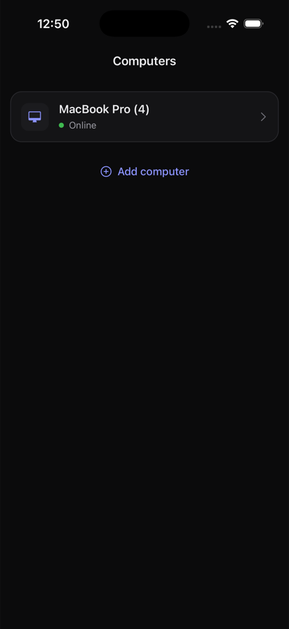
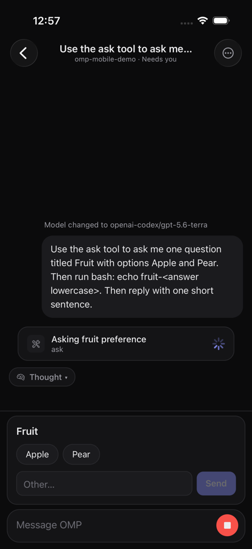
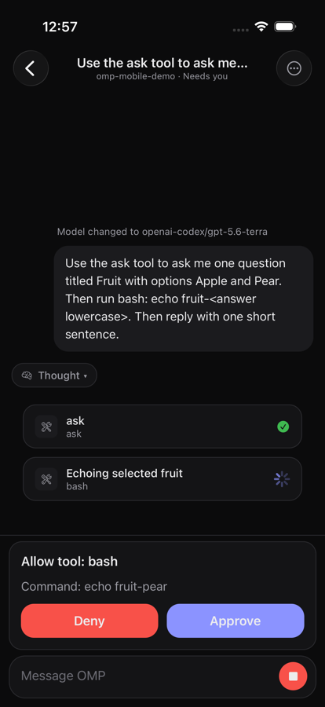
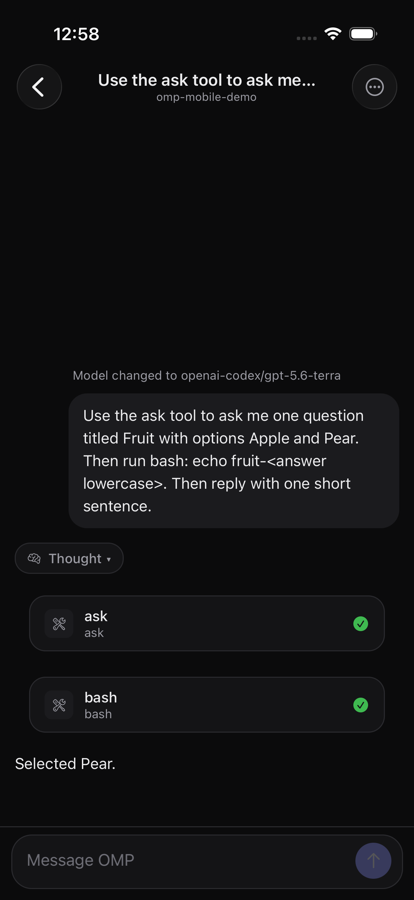
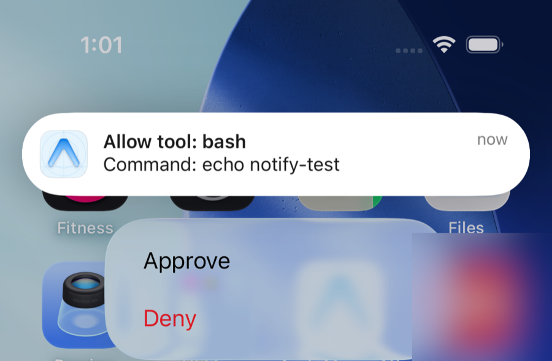
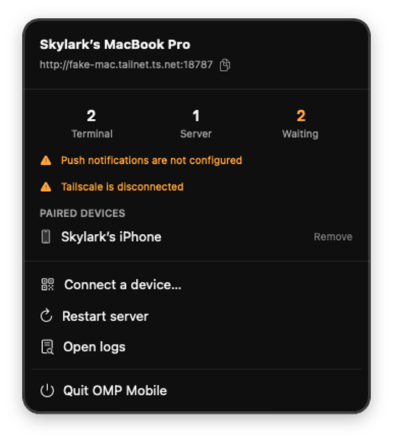
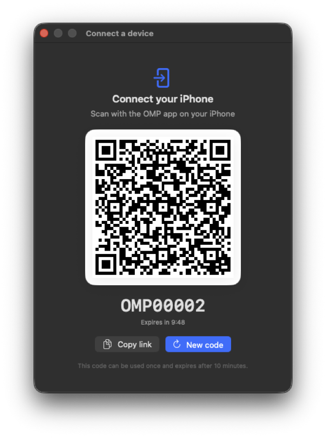
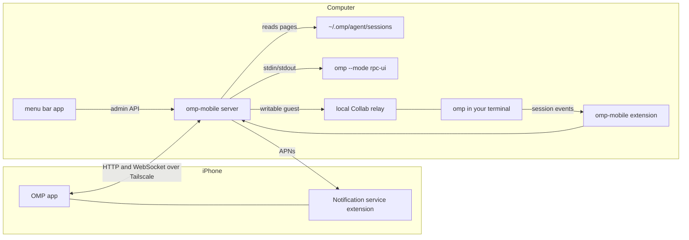

# OMP Mobile

OMP Mobile puts your [OMP](https://github.com/can1357/oh-my-pi) coding sessions in your pocket. Pair your iPhone with any computer that runs OMP, then browse old sessions, follow live ones, start new ones in a project folder, and answer the agent's questions and tool approvals from the app or straight from a notification.

Everything stays on your computer. The phone keeps only the list of paired computers and their credentials. Sessions, OMP processes, and push delivery all run on the computer you connect to, and the phone reaches it over your [Tailscale](https://tailscale.com) network.

<table>
  <tr>
    <td></td>
    <td></td>
    <td></td>
    <td></td>
  </tr>
  <tr>
    <td colspan="2"></td>
    <td></td>
    <td></td>
  </tr>
</table>

The menu bar screenshots use sample data.

## What you get

- **Session history.** Every OMP session on the computer, newest first, with titles and project folders. Transcripts load a page at a time as you scroll up, so a long session opens instantly.
- **Live sessions.** Watch the agent stream text, thinking, and tool calls. Send follow-up prompts, steer a running turn with a new message, or stop it.
- **Images.** Attach up to four images to a message: tap the photo button to pick from your library, or tap the message field and choose **Paste** when you have copied an image, such as a screenshot. The app scales them to at most 2048 pixels on the long edge and sends them as JPEG.
- **Model roles.** Switch a session between your OMP `smol`, `default`, and `slow` model roles (the `modelRoles` in your OMP config, thinking level included). Tap the model button under the message field and drag the slider; the change applies to a new session's first turn or to the next request of an existing one. A session running in your terminal changes models from the terminal. When the keyboard is closed (drag the transcript to close it) and the field is empty, the composer shrinks to a single line; tap it to bring back the full composer.
- **Skills.** Type `/skill:` (or just `/`) in the message field to list the skills OMP offers in the session's project: your user-level skills, the project's `.omp/skills`, and skills from installed plugins. Keep typing to fuzzy-filter by name (`vom` finds `verify-omp-mobile`) or by a word from the description; tap a skill to complete it and add your request after it. The computer asks OMP for the list, so it matches what `/skill:` accepts in the terminal; it caches each project's list for 30 seconds, and the app loads it when you open a session or pick a project. As in OMP's terminal, a completed command naming a known skill shows as a gold `✦ <name>` chip in the message field and in your sent messages, while OMP still receives `/skill:<name>`. Backspace removes a chip whole. The transcript shows the command you typed rather than the skill's full text.
- **Questions and approvals.** When the agent uses the `ask` tool or needs a tool approval, the app shows it pinned above the composer, and a push notification lets you long-press to **Approve** or **Deny** without opening the app.
- **New sessions from the phone.** Pick a recent project or browse folders on the computer, type a prompt, and the computer starts the session. Resume it later in your terminal with `omp --resume`.
- **Terminal sessions too.** A session you started in a terminal can be driven from the phone at the same time, through OMP Collab over a relay that stays on your computer.
- **A menu bar icon** on the Mac that shows the server's status and opens a QR code to pair a phone.

## How it works



The server tracks each session in one of three states:

| State | Viewing | Acting (prompt, answer, approve) |
|---|---|---|
| Idle, only the session file exists | The server reads the file. No OMP process starts. | The server starts `omp --mode rpc-ui --resume <file>` in the session's folder. |
| Running on the server | File history plus live RPC events | Through RPC |
| Running in your terminal | File history plus live Collab events | Through Collab as a writable guest |

When you close a terminal session, its Collab room closes. After the server sees both the extension's `session_shutdown` event and the process exit, the session becomes idle, and your next action resumes it under the server. The server closes its own OMP process once a turn settles and no phone is watching, so a session is never written by two processes at once.

## Requirements

- macOS with [Bun](https://bun.sh) 1.3.14 or later and OMP on your `PATH`. OMP 18.4.3 and 18.4.4 are tested. The server speaks OMP's Collab protocol version 3, so run `bun run e2e` after you upgrade OMP.
- Tailscale running on the computer and on the iPhone, signed in to the same tailnet with MagicDNS on.
- For the iPhone app: iOS 16 or later on the phone, and Xcode 26.2 or later, which needs macOS Sequoia 15.6 or later. Xcode 27 builds work too. TestFlight also needs an Apple Developer Program membership and an [Expo](https://expo.dev) account for EAS builds. A free Apple Account can [install the app directly](#install-with-a-free-apple-account) for 7 days at a time.

## Install the server on a computer

1. Clone the repository and install dependencies.

   ```sh
   git clone https://github.com/heyskylark/omp-mobile.git
   cd omp-mobile
   bun install
   ```

2. Preview what the installer changes.

   ```sh
   scripts/install.sh --dry-run --with-menubar
   ```

3. Run the installer.

   ```sh
   scripts/install.sh --with-menubar
   ```

The installer does the following:

- Creates `~/.omp-mobile/config.json` if it does not exist.
- Links `extension/omp-mobile.ts` into `~/.omp/agent/extensions/` so every OMP session reports its lifecycle to the server.
- Sets `collab.autoStart` to `control` and `collab.relayUrl` to the local relay, and records your previous values.
- Installs the LaunchAgent `com.heyskylark.omp-mobile.server`, which runs `bun server/src/main.ts` at login and restarts it if it stops. Logs go to `~/.omp-mobile/logs/`.
- With `--with-menubar`, builds the menu bar app into `~/Applications/OMP Mobile.app`, adds it as a login item, and opens it. Running the installer again replaces the running app and keeps a single login item.

To uninstall, run `scripts/uninstall.sh`. It removes the LaunchAgent, the extension link, the menu bar app, and the config file the installer created, and restores the OMP settings the installer changed. It keeps paired devices and logs in `~/.omp-mobile/`. Delete that folder to remove them.

### Configure the server

`~/.omp-mobile/config.json` accepts these keys. All of them are optional.

| Key | Default | Meaning |
|---|---|---|
| `port` | `8787` | Port for the app API. The server listens on the Tailscale IPv4 address and on `127.0.0.1`. |
| `relayPort` | `8788` | Loopback port for the Collab relay. |
| `machineName` | Computer name | Name shown in the app and the menu bar. Renaming the computer in the app writes this key. |
| `roots` | `["~"]` | Folders the app may browse and start sessions in. |
| `ompPath` | `omp` on `PATH` | Path to the OMP executable. |
| `rpcArgs` | none | Extra arguments for server-started sessions, for example `["--model", "openai-codex/gpt-5.6-terra:medium"]`. |
| `apns` | none | Push notification settings. See [Turn on push notifications](#turn-on-push-notifications). |

Restart the server after you change the file: choose **Restart server** in the menu bar, or run `launchctl kickstart -k gui/$(id -u)/com.heyskylark.omp-mobile.server`.

## Pair your iPhone

1. Click the OMP Mobile icon in the menu bar, then choose **Connect a device…**.
2. In the app, tap **Add computer** and scan the QR code.

A pairing code works once and expires after 10 minutes. After a phone uses it, the Mac confirms which device connected; choose **New code** to connect another device. You can also copy the pairing link on the Mac and paste it into the app. Pairing the same app install again replaces its previous registration on that computer. Remove a phone from the menu bar under **Paired devices**.

To rename a computer, open it in the app, tap the **…** button, edit **Name**, and tap **Save**. The server saves the name to `machineName` in `~/.omp-mobile/config.json` and uses it right away. Other paired phones pick it up the next time they load the Computers list.

## Get the app on your iPhone with TestFlight

The app builds with [EAS Build](https://docs.expo.dev/build/introduction/) and uploads to TestFlight with [EAS Submit](https://docs.expo.dev/submit/introduction/). EAS creates and stores the signing certificate and provisioning profiles for you.

1. Choose a bundle identifier you own. The default is `com.heyskylark.ompmobile`. To use another one, export it in every shell you build from.

   ```sh
   export OMP_BUNDLE_ID=com.example.ompmobile
   ```

2. Sign in to Expo and create the EAS project.

   ```sh
   cd app
   bunx eas-cli login
   bunx eas-cli init
   ```

3. Export the project ID that `eas init` printed and your Apple team ID from [Membership details](https://developer.apple.com/account#MembershipDetailsCard).

   ```sh
   export EAS_PROJECT_ID=<project id>
   export APPLE_TEAM_ID=<team id>
   ```

4. Build and submit.

   ```sh
   cd ..
   scripts/testflight.sh
   ```

   The first run asks you to sign in to your Apple account so EAS can create the app record, certificates, and profiles.

5. When the build finishes processing in App Store Connect, open **TestFlight**, add yourself as an internal tester, and install **OMP** from the TestFlight app on your iPhone.

Run `scripts/testflight.sh` again for each new build. The production profile increments the build number automatically.

### Turn on push notifications

Push notifications go from each computer straight to Apple. Each computer needs an APNs key.

1. In the Apple Developer portal, open **Certificates, Identifiers & Profiles** > **Keys**, create a key with **Apple Push Notifications service (APNs)** enabled, and download the `.p8` file.
2. Move the file to `~/.omp-mobile/` on the computer.
3. Add the key to `~/.omp-mobile/config.json`.

   ```json
   {
     "apns": {
       "keyPath": "~/.omp-mobile/AuthKey_ABC123XYZ.p8",
       "keyId": "ABC123XYZ",
       "teamId": "<team id>",
       "bundleId": "com.heyskylark.ompmobile"
     }
   }
   ```

4. Restart the server. The menu bar stops showing **Push notifications are not configured**. This state is reported by `apnsConfigured` in the admin status response rather than duplicated in its general `problems` list.

The phone registers for notifications when you pair it. Release builds, including TestFlight, register for the production APNs environment and Debug builds for the sandbox. The server sends each phone's notifications to the environment it registered. Each notification's text is encrypted with a key shared only by that phone and the computer, so Apple sees a generic "New activity" placeholder, and the app's notification service extension decrypts the real text on the phone.

## Install with a free Apple account

Without an Apple Developer Program membership, Xcode can sign the app with your free Personal Team and install it on a connected iPhone. The install stops launching after 7 days; build and install again to renew it. Personal Teams cannot use the Push Notifications capability, so this build has no push notifications. Everything else works, and pairing skips push registration.

1. In Xcode, open **Settings** > **Accounts**, add your Apple Account, select its Personal Team, choose **Manage Certificates**, and add an **Apple Development** certificate.
2. Read your Personal Team ID from that certificate. It is the `OU` value.

   ```sh
   security find-certificate -c "Apple Development" -p | openssl x509 -noout -subject
   ```

3. Choose a bundle identifier for this build, and export the settings in the shell you build from.

   ```sh
   export OMP_BUNDLE_ID=com.<your-name>.ompmobile.dev
   export APPLE_TEAM_ID=<team id>
   export OMP_PERSONAL_TEAM=1
   ```

   Use a different identifier from the one you will ship through TestFlight. Xcode registers the identifier and its `group.` app group to your Personal Team, and you cannot delete a Personal Team's identifiers yourself, so reusing the TestFlight identifier can block your paid team from registering it later. The identifier must also not be registered by anyone else, so `com.heyskylark.ompmobile.dev` works only for the repository owner.

   `OMP_PERSONAL_TEAM=1` leaves out the push entitlement that a Personal Team cannot sign.

4. Connect the iPhone with a cable and trust the computer. On iOS 16 or later, turn on **Settings** > **Privacy & Security** > **Developer Mode** and restart the phone. The setting appears after the phone has been connected to Xcode once.
5. Generate the native project and install a Release build, which embeds the JavaScript bundle so you do not need Metro.

   ```sh
   cd app
   bunx expo prebuild -p ios --clean
   bunx expo run:ios --device --configuration Release
   ```

6. Before the first launch, open **Settings** > **General** > **VPN & Device Management** on the iPhone and trust your developer app.

Run `bunx expo prebuild -p ios --clean` whenever you change these variables, because the generated `ios/` folder keeps the previous signing settings.

## Develop

| Path | What it holds |
|---|---|
| `packages/protocol` | The app and server contract: HTTP bodies, WebSocket messages, timeline items, push payloads. |
| `server` | The Bun server: session history and paging (`src/history`), live sessions over RPC and Collab (`src/live`), HTTP, pairing, and push. |
| `extension/omp-mobile.ts` | The OMP extension that reports session lifecycle, questions, and approvals to the server. |
| `app` | The Expo app (SDK 55, Expo Router, NativeWind), the native module in `app/modules/omp-native`, and the notification service extension in `app/targets/notification-service`. |
| `macos` | The SwiftUI menu bar app. `macos/build.sh` builds `macos/build/OMP Mobile.app`. |
| `scripts` | Install, uninstall, TestFlight, and the end-to-end check. |

Common commands, run from the repository root:

```sh
bun run server        # run the server in the foreground (uses ~/.omp-mobile unless OMP_MOBILE_HOME is set)
bun run typecheck     # protocol, server, and app
bun run test          # server unit tests
bun run e2e           # end-to-end check against real OMP, described below
bun run format        # Biome formatter
```

`bun run e2e` starts its own server with a temporary home on ports 18787 and 18788, then drives it through the public API. It pairs a device, pages real history, starts a session from the "phone", answers an `ask` question and an approval, hands the session off, opens a real terminal session in a pseudo-terminal, approves a tool call through Collab, exits the terminal, and resumes the session under the server. It uses a small model and cleans up after itself. Run it after upgrading OMP, because the Collab wire protocol must match exactly.

To run the app in the iOS Simulator, boot a simulator and run the build script. It builds a Release app with the JavaScript bundle embedded, so you do not need Metro. It installs on the first booted simulator, or on the one whose UDID you pass, for example `scripts/simulator.sh <udid>`. It regenerates `app/ios` with `expo prebuild --clean` when the folder is missing or was generated from a different app config, `OMP_BUNDLE_ID`/`OMP_PERSONAL_TEAM`, or native sources.

```sh
xcrun simctl boot 'iPhone 17 Pro' && open -a Simulator
scripts/simulator.sh
```

For fast UI iteration, run `bunx expo start --dev-client` in `app/` and open a Debug build instead.

The Simulator has no camera. To pair it, copy the pairing link from the menu bar and open it with `xcrun simctl openurl booted '<link>'`. `app/dev/seal-push.ts` writes a sealed sample push that you can send with `xcrun simctl push booted com.heyskylark.ompmobile app/dev/push-sample.apns`.

## Security

- The app API binds only to the computer's Tailscale address and to `127.0.0.1`. Tailscale encrypts the traffic, so the app uses plain HTTP and WebSocket to `*.ts.net` names.
- Pairing codes are single-use and expire after 10 minutes. Device tokens are stored as SHA-256 hashes in `~/.omp-mobile/devices.json` with mode 0600.
- Admin routes (used by the menu bar) and the extension endpoint exist only on the loopback listener and need tokens from `~/.omp-mobile/server.json`, which is also mode 0600.
- Folder browsing and new sessions are limited to the configured `roots`, checked after resolving symbolic links.

## Known limitations

- The app targets Expo SDK 55 because SDK 56 and later need Xcode 26.4. After you update Xcode, upgrade with `bunx expo install expo@latest --fix` in `app/`.
- The minimum iOS version is 16.0 instead of SDK 55's default of 15.1. With the iOS 27 SDK, `expo-router` 55 uses APIs that require iOS 16, and `app/plugins/with-pod-deployment-target.js` raises every pod target to the app's deployment target because Xcode 27 rejects the iOS 12.4 and 9.0 targets that some pod resource bundles declare.
- iOS 27 stops apps that do not use the UIKit scene life cycle at launch, and the SDK 55 template still creates its window in the app delegate. `app/plugins/with-scene-lifecycle.js` adds a scene manifest to Info.plist and a `SceneDelegate` that hosts React Native and forwards URLs and life-cycle events to the app delegate. Expo SDK 58 generates this setup itself, so remove the plugin when upgrading.
- `scripts/testflight.sh` has not been run yet, because it needs your Apple and Expo accounts. The app config sets `aps-environment` to `development`, and App Store export is expected to switch it to `production` from the distribution profile. Confirm that with the first TestFlight build before relying on push.
- Push delivery through APNs and decryption in the notification service extension have not been tested on a physical device. The Simulator shows the notification actions and runs the Approve action end to end, but it did not run the extension for `simctl push`.
- A session opened in a terminal after the server started working on it is not blocked by OMP. The server marks it as a conflict, stops accepting phone input for it, and closes its own process when the turn settles.
- In a session the server runs, an `ask` call with several questions cannot finish a multiple-choice question from the phone. OMP's RPC mode offers no **Done** option there and expects the terminal's → key to move on, which RPC cannot send. Tapping options only toggles them; answer with **Other…** to continue. Sessions driven through Collab offer **Next →** and are not affected.
- OMP does not forward images with a `/skill:` prompt, so images attached to one are dropped. Send them in a separate message.
- There is no Apple Watch app yet.
